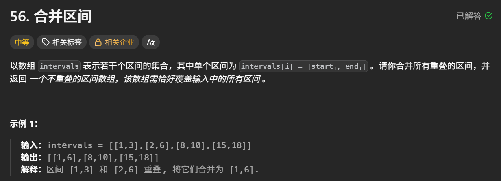
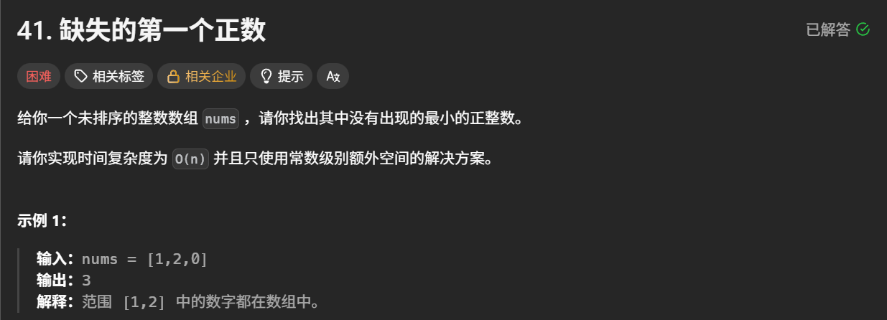
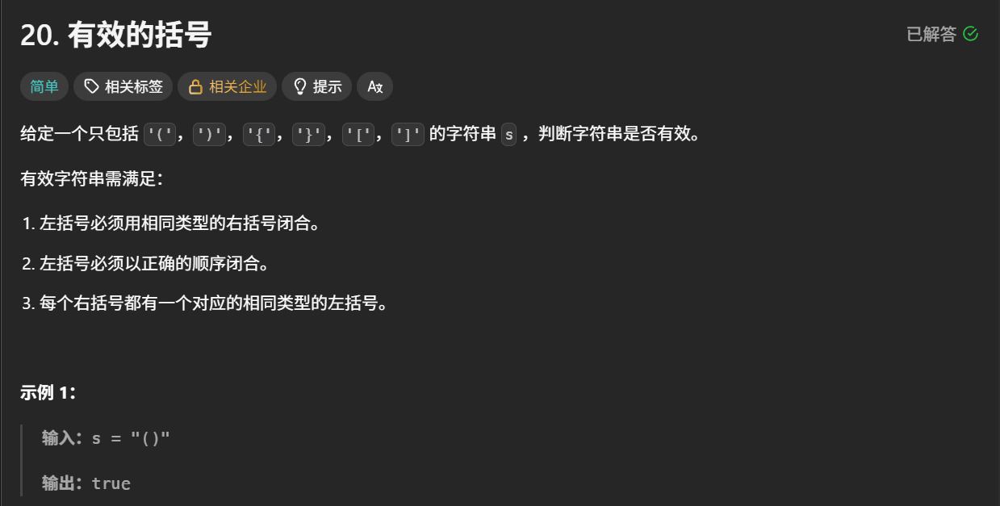
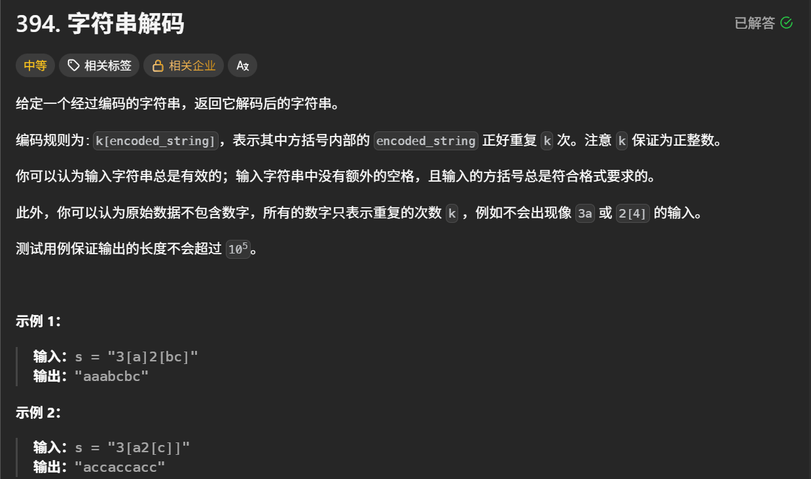
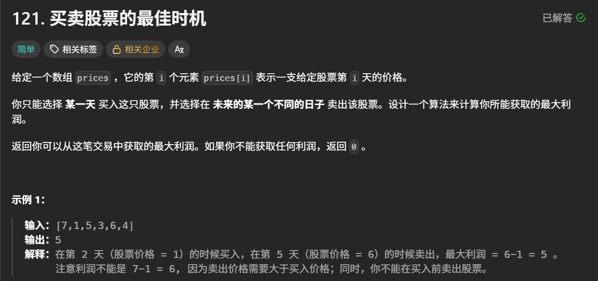
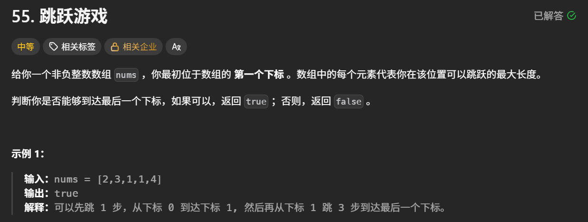

# 力扣 hot100 题解

---

## 1、最大子数组和


```java
class Solution {
    public int maxSubArray(int[] nums) {
        // 定义一个dp数组，数组中下标i处的元素表示原nums数组中以下标i结尾的子数组的最大和
        int[] dp = new int[nums.length];
        dp[0] = nums[0];
        for (int i = 1; i < nums.length; i++) {
            dp[i] = Math.max(nums[i], dp[i - 1] + nums[i]);
        }

        // 遍历dp数组，找到最大的那个值，就是我们想要的结果
        int res = dp[0];
        for (int i = 1; i < dp.length; i++) {
            res = Math.max(res, dp[i]);
        }

        return res;
    }
}
```

## 2、合并区间



```java
class Solution {
    public int[][] merge(int[][] intervals) {
        // 将所有区间按照左端点进行排序
        Arrays.sort(intervals, new Comparator<int[]>() {
            public int compare(int[] interval1, int[] interval2) {
                return interval1[0] - interval2[0];
            }
        });

        // 遍历每个区间，判断是直接加入集合中，还是与集合中的前一个数组合并
        List<int[]> res = new ArrayList<>();
        for (int[] interval : intervals) {
            int l = interval[0], r = interval[1];
            if (res.isEmpty() || l > res.get(res.size() - 1)[1]) {
                res.add(interval);
            } else {
                // 合并两个区间，右端点取两个区间中较大的那个
                res.get(res.size() - 1)[1] = Math.max(res.get(res.size() - 1)[1], r);
            }
        }

        return res.toArray(new int[res.size()][]);
    }
}
```

## 3、轮转数组


```java
class Solution {
    public void rotate(int[] nums, int k) {
        // 创建一个新数组作为轮转后的数组，则原nums数组中i处的元素应该在新数组的(i + k) % n处
        int n = nums.length;
        int[] arr = new int[n];

        for (int i = 0; i < n; i++) {
            arr[(i + k) % n] = nums[i];
        }

        // 将新数组中的内容拷贝回原数组
        System.arraycopy(arr, 0, nums, 0, n);
    }
}
```

## 4、除自身以外数组的乘积


```java
class Solution {
    public int[] productExceptSelf(int[] nums) {
        int n = nums.length;
        int[] answer = new int[n];

        // answer数组中i处的值应该等于nums数组中i处左边的乘积乘以右边的乘积
        // 先计算每个元素左边的乘积，填入answer中
        answer[0] = 1;
        for (int i = 1; i < n; i++) {
            answer[i] = answer[i - 1] * nums[i - 1];
        }
        // 再计算每个元素右侧的乘积，追乘到answer中
        int r = 1;
        for (int i = n - 1; i >= 0; i--) {
            answer[i] = answer[i] * r;
            r = r * nums[i];
        }

        return answer;
    }
}
```

## 5、缺失的第一个正数



```java
class Solution {
    public int firstMissingPositive(int[] nums) {
        // 我们可以遍历数组，将处于[1,N]范围内的正整数移动到它们应有的位置（即按顺序排列）
        int n = nums.length;
        for (int i = 0; i < n; i++) {
            // 对于nums[i]，如果它是[1,N]范围内的正整数的话，它的位置应该是nums[i] - 1
            while (nums[i] > 0 && nums[i] <= n && nums[nums[i] - 1] != nums[i]) {
                int temp = nums[i];
                nums[i] = nums[nums[i] - 1];
                nums[temp - 1] = temp;
            }
        }

        for (int i = 0; i < n; i++) {
            if (nums[i] != i + 1) {
                return i + 1;
            }
        }

        return n + 1;
    }
}
```

## 6、有效的括号



```java
class Solution {
    public boolean isValid(String s) {
        // 准备一个map作为做右括号的映射
        Map<Character, Character> map = new HashMap<>();
        map.put(')', '(');
        map.put('}', '{');
        map.put(']', '[');
        // 遍历字符串，遇到左括号入栈，遇到右括号就与栈顶元素比较
        Deque<Character> stack = new LinkedList<>();
        int n = s.length();
        for (int i = 0; i < n; i ++) {
            char ch = s.charAt(i);
            if (ch == '(' || ch == '{' || ch == '[') {
                stack.push(ch);
            } else {
                if (stack.peek() == map.get(ch)) {
                    stack.pop();
                } else {
                    return false;
                }
            }
        }
        // 遍历结束，如果栈不为空，则返回false
        if (stack.size() != 0) {
            return false;
        }
        return true;
    }
}
```

## 7、最小栈


```java
class MinStack {

    // 用来存储元素
    Deque<Integer> stack;
    // 用来存储每阶段对应的最小值，栈顶始终存储当前stack中最小的值
    Deque<Integer> minStack;

    public MinStack() {
        stack = new LinkedList<>();
        minStack = new LinkedList<>();
        minStack.push(Integer.MAX_VALUE);
    }
    
    public void push(int val) {
        stack.push(val);
        minStack.push(Math.min(minStack.peek(), val));
    }
    
    public void pop() {
        stack.pop();
        minStack.pop();
    }
    
    public int top() {
        return stack.peek();
    }
    
    public int getMin() {
        return minStack.peek();
    }
}

/**
 * Your MinStack object will be instantiated and called as such:
 * MinStack obj = new MinStack();
 * obj.push(val);
 * obj.pop();
 * int param_3 = obj.top();
 * int param_4 = obj.getMin();
 */
```

## 8、字符串解码



```java
class Solution {
    public String decodeString(String s) {
        // 准备一个栈
        Deque<Character> stack = new LinkedList<>();

        // 遍历字符串s，将每个字符依次入栈
        for (int i = 0; i < s.length(); i++) {
            // 如果不是右括号，则直接入栈
            if (s.charAt(i) != ']') {
                stack.push(s.charAt(i));
            } else {
                // 如果是右括号，则一直出栈到左括号，获取当前括号中的字符串
                StringBuilder sb1 = new StringBuilder();
                char ch = stack.pop();
                while (ch != '[') {
                    sb1.append(ch);
                    ch = stack.pop();
                }
                String str = sb1.reverse().toString();
                // 获取此时栈顶的数字
                sb1.setLength(0);
                while (!stack.isEmpty() && stack.peek() >= '0' && stack.peek() <= '9') {
                    sb1.append(stack.pop());
                }
                int num = Integer.valueOf(sb1.reverse().toString());
                // 构造重复后的字符串，并重新入栈
                sb1.setLength(0);
                for (int j = 0; j < num; j++) {
                    sb1.append(str);
                }
                str = sb1.toString();
                for (int j = 0; j < str.length(); j++) {
                    stack.push(str.charAt(j));
                }
            }
        }

        // 此时栈中就是最终的字符串
        StringBuilder sb2 = new StringBuilder();
        while (!stack.isEmpty()) {
            sb2.append(stack.pop());
        }
        return sb2.reverse().toString();
    }
}
```

## 9、每日温度


```java
class Solution {
    public int[] dailyTemperatures(int[] temperatures) {
        int n = temperatures.length;
        int[] ans = new int[n];

        // 准备一个栈，用来存储temperatures数组的下标，即日期
        Deque<Integer> stack = new LinkedList<>();

        // 遍历temperatures数组
        for (int i = 0; i < n;i++) {
            // 如果栈为空或者当前遍历到的温度小于栈顶日期对应的温度，则还没有找到更高的温度，入栈
            if (stack.isEmpty() || temperatures[stack.peek()] > temperatures[i]) {
                stack.push(i);
            } else {
                // 找到了一个比栈顶日期温度高的，则栈中比该温度低的都可以出栈
                while (!stack.isEmpty() && temperatures[stack.peek()] < temperatures[i]) {
                    ans[stack.peek()] = i - stack.pop();
                }
                stack.push(i);
            }
        }

        return ans;
    }
}
```

## 10、买卖股票的最佳时机



```java
class Solution {
    public int maxProfit(int[] prices) {
        // 如果对于每一天，我们都能知道未来该股票的最高价格，就好了
        // 我们可以采用动态规划，计算出每一天对应的未来最高价
        int n = prices.length;
        int[] dp = new int[n];
        dp[n - 1] = 0;
        for (int i = n - 2; i >= 0; i--) {
            dp[i] = Math.max(dp[i + 1], prices[i + 1]);
        }

        // 既然已经知道了每一天对应的未来最高价，那么每一天买入的利润也能确定，进而可以确定最大利润
        int ans = 0;
        for (int i = 0; i < n; i++) {
            ans = Math.max(ans, dp[i] - prices[i]);
        }

        return ans;
    } 
}
```

## 11、跳跃游戏



```java
class Solution {
    public boolean canJump(int[] nums) {
        int n = nums.length;
        // 遍历数组，依次在当前能到达的最大范围内计算每个位置所能到达的最大位置
        int max = 0;
        for (int i = 0; i < n; i++) {
            // 当前位置在能到达的最大范围内
            if (i <= max) {
                // 计算从当前位置出发所能到达的最大位置，并与全局最大值比较
                max = Math.max(max, i + nums[i]);
                // 一旦max大于等于n-1了，就表示能到达最后一个位置
                if (max >= n - 1) {
                    return true;
                }
            }
        }

        return false;
    }
}
```

## 12、跳跃游戏 II （md难死我了）


```java
class Solution {
    public int jump(int[] nums) {
        int n = nums.length;
        int steps = 0;
        int round = 0;
        int max = 0;
        // 要想用最少的步数吗，就要在每次能到达的范围内选择能跳到最远的那个位置作为下一次的起跳点
        for (int i = 0; i <= round; i++) {
            if (round >= n - 1) {
                // 已经可以到达终点
                return steps;
            }
            max = Math.max(max, i + nums[i]);
            if (i == round) {
                round = max;
                steps++;
            }
        }

        return steps;
    }
}
```

